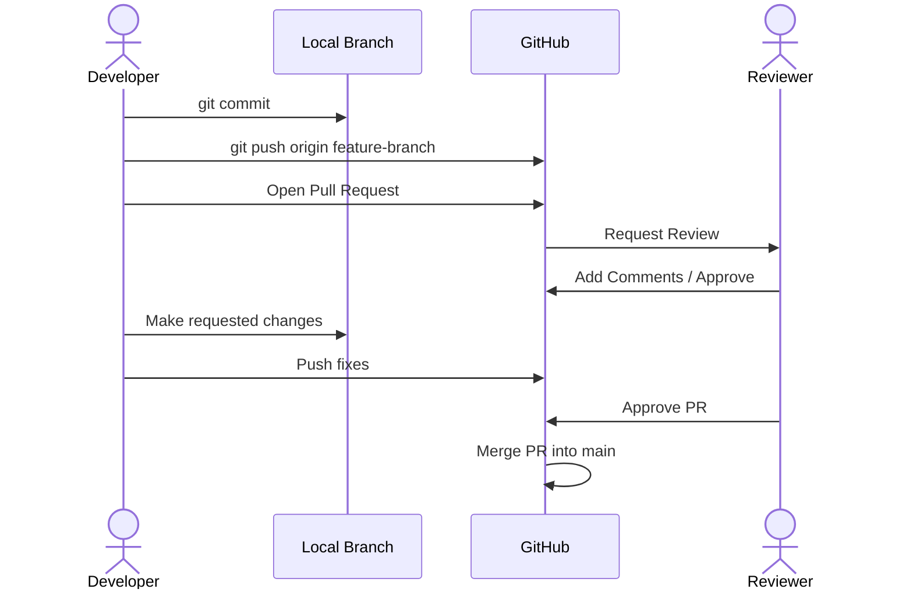

# Pull Request (PR)

## What is it?
A Pull Request (PR) is a GitHub feature (not a Git command) that allows you to propose changes to a repository. You are literally requesting the owner of the repository to "pull" your code into their `main` branch.

## Why do we use it?
In professional environments and open-source projects, developers **never** push code directly to the `main` branch. Pushing directly to `main` is dangerous because if the code contains a bug, the entire production application breaks. 

Instead, developers use a Pull Request workflow:
1. You create a separate branch.
2. You write your code and push the branch to GitHub.
3. You open a Pull Request.
4. Other developers read your code, leave comments, ask for changes, and eventually approve it.
5. Once approved, the code is safely merged into `main`.

This peer-review process ensures high code quality, catches bugs early, and shares knowledge among the team.

## How to Create a Pull Request

**Step 1: Push your branch**
Make sure you have pushed your feature branch to GitHub:
```bash
git switch -c add-login
git add .
git commit -m "feat: add login page"
git push -u origin add-login
```

**Step 2: Open GitHub**
Go to your repository on GitHub. You will automatically see a highlighted green banner that says **"add-login had recent pushes"** with a button saying **Compare & pull request**. Click it.

**Step 3: Fill out the PR Details**
- **Title:** Make it clear and concise (e.g., `Add user login authentication`).
- **Description:** Explain *what* you changed, *why* you changed it, and *how* reviewers can test it. If your PR fixes a specific issue, write "Fixes #123" in the description to automatically link them.

**Step 4: Create the PR**
Click the green **Create pull request** button.

## The Review Process
Once the PR is open, your teammates will review it. They can:
- **Comment:** Ask questions about specific lines of code.
- **Request Changes:** Formally block the merge until you fix something.
- **Approve:** Give the green light to merge.

If they request changes, you don't need to open a new PR. You simply go back to your code editor, make the fixes, commit them, and run `git push`. The existing PR will automatically update with your new commits!

## Common Mistakes
- **Massive Pull Requests:** Reviewing 2,000 lines of code is a nightmare for your teammates. Keep PRs small and focused on a single feature or bug fix.
- **Leaving the description blank:** A PR with no description forces the reviewer to guess what you were trying to do. Always provide context.
- **Merging your own PR without review:** If you are on a team, wait for someone else to approve it before clicking merge.

## Quick Summary
- A request for someone to review and merge your code.
- Essential for team collaboration and code quality.
- Keep PRs small, descriptive, and focused.
- Created on the GitHub website after pushing a feature branch.

## Diagram


