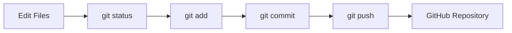
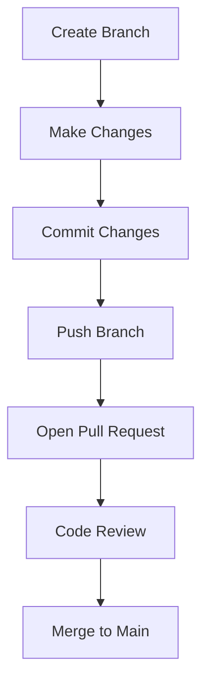

# Git and GitHub Notes for Beginners

<p align="center">
  <strong>A beginner-friendly Git and GitHub learning repository with topic-wise notes, diagrams, workflows, commands, examples, and practice tasks.</strong>
</p>

<p align="center">
  
  
  
  
</p>

## Overview

**Git and GitHub Notes for Beginners** is a structured learning repository created for students and beginners who want to master version control and team collaboration.

The content is organized into logical topic modules, starting from basic Git initialization and moving all the way up to branching, merging, open-source contribution, and GitHub features.

This repository is designed to be easy to read, practical, and useful as both a learning guide and a quick reference cheatsheet.

## What You Will Learn

* The basics of version control and why it's essential.
* How to track files, make commits, and manage local history.
* Working with branches and resolving merge conflicts.
* Collaborating on GitHub, including pull requests and forks.
* Advanced Git workflows, undoing mistakes, and best practices.

## Recommended Study Order

1. **Introduction**: Understand the "why" before the "how".
2. **Setup**: Get Git installed and authenticated with GitHub.
3. **Basic Git Workflow**: Master local tracking (`add`, `commit`, `status`).
4. **GitHub Workflow**: Learn to `push`, `pull`, and `clone`.
5. **Branching & Merging**: Understand parallel development.
6. **Collaboration**: Learn about PRs, Forks, and Code Reviews.
7. **Practice**: Complete the beginner and intermediate tasks.

## Basic Git Workflow



## GitHub Collaboration Workflow



## Folder Structure

```txt
git-github-notes/
├── README.md
├── ROADMAP.md
├── CHEATSHEET.md
├── CONTRIBUTING.md
├── 01-introduction/
├── 02-setup/
├── 03-basic-git-workflow/
├── 04-github-workflow/
├── 05-branching-and-merging/
├── 06-collaboration/
├── 07-undo-and-fix/
├── 08-github-features/
├── 09-practical-workflows/
├── 10-practice/
└── diagrams/
```

Check out [ROADMAP.md](./ROADMAP.md) for a step-by-step path from beginner to advanced.

## Who Is This Repository For?

This repository is useful for:

* Absolute beginners who want to learn version control.
* Students preparing for software engineering roles.
* Developers looking for a structured reference to Git commands and workflows.
* Mentors and teachers preparing basic Git sessions.

## How to Use This Repository

You can use this repository in several ways:

### 1. Read Step by Step
**Clone the repository** to your local machine:
```bash
git clone https://github.com/USERNAME/git-github-notes.git
cd git-github-notes
```
Read the topics in the recommended order.

### 2. Use as a Reference Guide
Jump straight into the `09-practical-workflows` or the `CHEATSHEET.md` when you forget how to do something.

### 3. Hands-on Practice
Practice the commands in a separate dummy repository.

## Contribution Guidelines

Contributions are welcome! Found a typo or have an idea to improve the notes? Please see [CONTRIBUTING.md](./CONTRIBUTING.md) for guidelines on opening issues and submitting pull requests.

You can contribute by:
* Fixing spelling or formatting issues
* Improving explanations
* Adding examples or diagrams
* Expanding notes with new practical workflows

Before contributing, make sure your changes are clear, simple, and helpful for beginners.

<h2 align="center">Maintainer</h2>

<p align="center">
  This repository is maintained as a student-friendly learning resource under <strong>Enggvault</strong>.
</p>

<p align="center">
  Made with dedication for students learning version control.
</p>

<p align="center">
  <strong>Developed and Maintained by <a href="https://tushardevx.tech">Tushar Kanti Dey</a></strong>
</p>

<p align="center">
  If this repository helps you, consider giving it a star! ⭐
</p>
