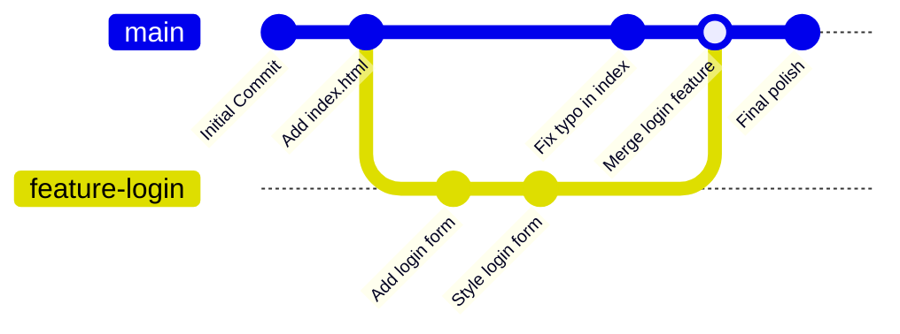

# Branch and Merge Workflow Diagram

This diagram shows parallel development using branches, and bringing the code back together using a merge.

```mermaid
gitGraph
    commit id: "Initial Commit"
    commit id: "Add index.html"
    branch feature-login
    checkout feature-login
    commit id: "Add login form"
    commit id: "Style login form"
    checkout main
    commit id: "Fix typo in index"
    merge feature-login id: "Merge login feature"
    commit id: "Final polish"
```
