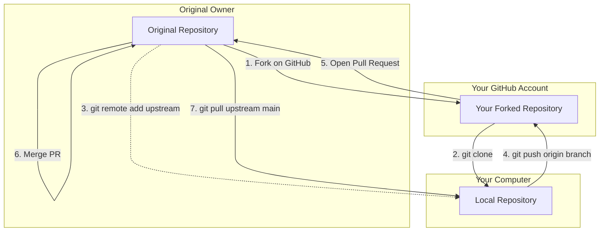

# Fork and Upstream Workflow Diagram

This diagram explains the open-source contribution workflow involving forks and upstreams.

```mermaid
flowchart TD
    subgraph Original Owner
        OR[Original Repository]
    end

    subgraph Your GitHub Account
        FR[Your Forked Repository]
    end

    subgraph Your Computer
        LR[Local Repository]
    end

    OR -- "1. Fork on GitHub" --> FR
    FR -- "2. git clone" --> LR
    OR -. "3. git remote add upstream" .-> LR
    LR -- "4. git push origin branch" --> FR
    FR -- "5. Open Pull Request" --> OR
    OR -- "6. Merge PR" --> OR
    OR -- "7. git pull upstream main" --> LR
```
