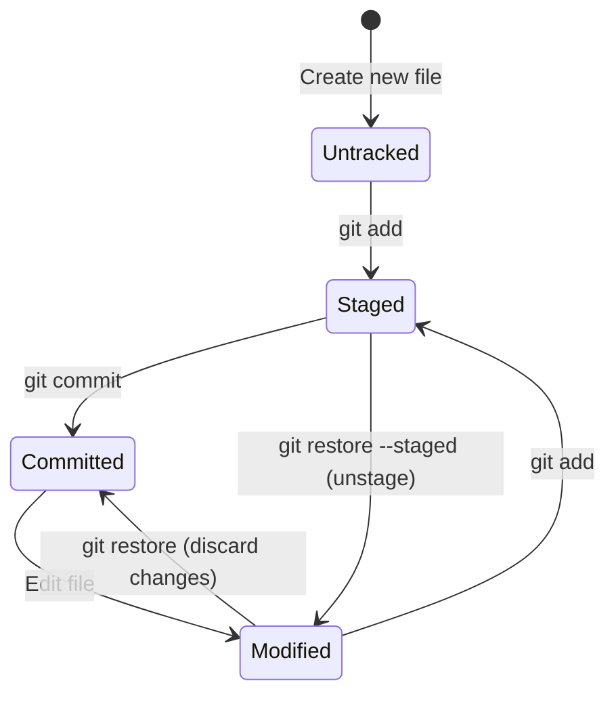

# Git File Lifecycle Diagram

This diagram shows how a file moves through the different stages in Git.

```mermaid
stateDiagram-v2
    [*] --> Untracked : Create new file
    Untracked --> Staged : git add
    Staged --> Committed : git commit
    Committed --> Modified : Edit file
    Modified --> Staged : git add
    Modified --> Committed : git restore (discard changes)
    Staged --> Modified : git restore --staged (unstage)
```
