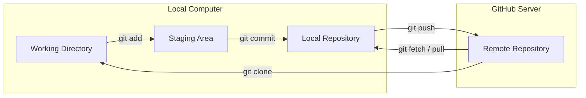

# Local to Remote Workflow Diagram

This diagram shows the relationship between your local computer and the remote GitHub server.

```mermaid
flowchart LR
    subgraph Local Computer
        WD[Working Directory] -- "git add" --> SA[Staging Area]
        SA -- "git commit" --> LR[Local Repository]
    end

    subgraph GitHub Server
        RR[Remote Repository]
    end

    LR -- "git push" --> RR
    RR -- "git fetch / pull" --> LR
    RR -- "git clone" --> WD
```
