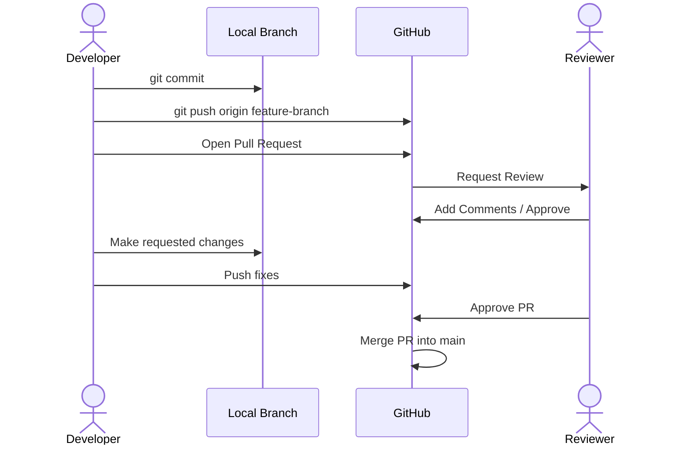

# Pull Request Workflow Diagram

This diagram shows the standard team workflow using Pull Requests for code review.

```mermaid
sequenceDiagram
    actor Developer
    participant Local Branch
    participant GitHub
    actor Reviewer

    Developer->>Local Branch: git commit
    Developer->>GitHub: git push origin feature-branch
    Developer->>GitHub: Open Pull Request
    GitHub->>Reviewer: Request Review
    Reviewer->>GitHub: Add Comments / Approve
    Developer->>Local Branch: Make requested changes
    Developer->>GitHub: Push fixes
    Reviewer->>GitHub: Approve PR
    GitHub->>GitHub: Merge PR into main
```
